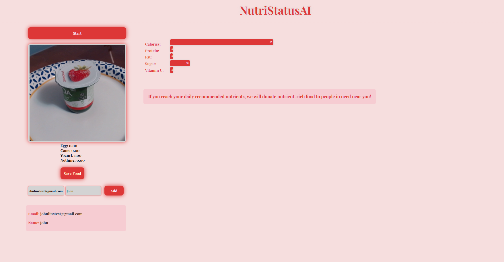

# NutriStatusAI

https://youtu.be/w89N5XBnn_g

# Inspiration: 
Our inspiration to make this project was that we wanted to help people visualize their daily intake of vitamins and nutrients. We achieved this goal by allowing the user to visualize the number of nutrients contained in their food, as well as notify the users of their daily nutrient intake. We also felt that the best way to support food-insecure communities was to donate nutrient-rich food every time the user reached their daily nutrient intake, which not only promoted a healthy lifestyle amongst everyday people but to also help the less fortunate. 

# What It Does: 
NutriStatAI allows anyone to take a picture of their food before they eat it, and it returns nutritional facts such as calcium, protein, vitamin C, ext. And displays it in an intuitive graph which allows the user to more easily visualize their nutrition. Every time they take a picture of their food, the bar chart updates with new values. Once the user reaches their daily recommended nutrients, nutrient-rich food is donated to people in need in their region!

# How We Built It: 
The API was built using the Go programming language in conjunction with the Mux router while the machine learning component was built using Tensorflow.js! We trained the neural network on 3 foods: an egg, yogurt, and a candy cane (to stick to the Christmas theme). Challenges We Ran Into: We ran into a plethora of bugs as problems, most of our problems arose when working on the chart. First, we were unable to get the JS to populate it, but once we figured that out, we have even more problems trying to get it to auto-update. It all worked out in the end.

# Accomplishments That We’re Proud Of: 
We are quite proud of the way our frontend turned out. We never really had a problem building an API on the backend but creating a responsive and good-looking user interface has always been a challenge. Luckily, after many failed attempts, the UI/UX for this project turned out just fine.

# What We Learned: 
As a team, we learned that working with vanilla HTML, CSS, and JavaScript can be very inconvenient as well as limiting and that it is a lot more ideal to just use a frontend framework like React.js. In addition to that, Daniel learned how to use TensorFlow.js and Google’s Teachable Machine. 

# What’s next: 
If we were to deploy it, we would monetize it somehow to fulfill the promise, “If you reach your daily recommended nutrients, we will donate nutrient-rich food to people in need near you!”